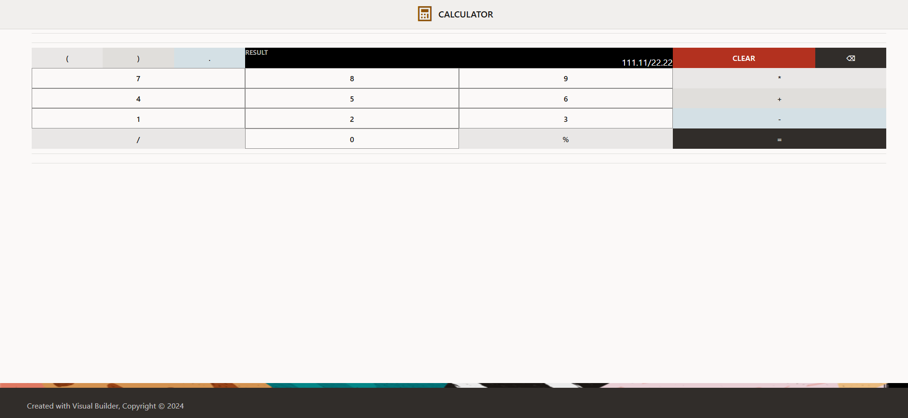

# Mobile-Style Calculator App 

A responsive, mobile-style calculator web application built using **Oracle Visual Builder (VB)**.
This project demonstrates the combination of low-code UI development with custom JavaScript logic, centralized state management, and reusable event-driven architecture.

---

## 📸 Preview

### Screenshot



### Demo (GIF)


---

## 🚀 Features

* Standard arithmetic operations: `+`, `-`, `*`, `/`, `%`
* Support for **parentheses** `(` `)` enabling grouped expressions
* Real-time input concatenation for building expressions dynamically
* Backspace and clear functionality for input control
* Centralized state management using a single display variable
* Accessible UI using Oracle JET (`aria-label`, `label-hint`)
* Mobile-style responsive layout using Flex containers
* Clean, minimal interface inspired by real calculator design

---

## 🛠️ Technical Implementation & Architecture

Although built in a low-code environment, the application relies on structured logic, reusable action chains, and controlled state updates.

---

### 1. Centralized State Management

The application uses a single page-level variable:

```js
displayString
```

This variable stores the entire calculator input as a string and acts as the **single source of truth** for the UI.
The display component is directly bound to this variable, ensuring instant synchronization between user input and the interface.

---

### 2. String-Based Expression Handling

Instead of performing step-by-step calculations, all inputs are stored as a complete expression string.

This approach ensures:

* **Correct concatenation** (e.g., `7` → `75`, not `12`)
* **Proper operator precedence (PEMDAS)**
* Simpler logic by deferring evaluation until execution

---

### 3. Optimized Action Chains

The application avoids redundant logic by using a minimal set of reusable action chains:

* **AppendCharChain**
  Handles all numeric and operator inputs using a mapped parameter (`charToAdd`) and appends it to `displayString`.

* **BackspaceChain**
  Removes the last character using substring/slice logic.

* **ClearChain**
  Resets the display state to an empty string.

* **EqualsToChain**
  Evaluates the full expression string using JavaScript and updates the display with the result.

---

### 4. Expression Evaluation

The calculator evaluates expressions using JavaScript:

```js
eval(displayString)
```

This allows the system to process complete expressions with correct precedence and parentheses support.

---

### 5. UI & Layout

The interface is built using Oracle JET components:

* `<oj-input-text>` (readonly) as the display
* `<oj-button>` for inputs

Layout is structured using **Flex Containers** to maintain a centered, mobile-style design across different screen sizes.

---

## ⚠️ Limitations

* Uses JavaScript `eval()` for evaluation (not safe for production use)
* No validation for malformed expressions (e.g., `++`, multiple decimals)
* Limited to basic arithmetic operations
* Requires Oracle Visual Builder runtime (cannot run as a standalone static app)

---

## ⚙️ How to Run This Project

This application depends on the Oracle Visual Builder runtime environment.

To run the project:

1. Clone or download this repository as a `.zip`
2. Open your **Oracle Visual Builder** instance
3. Navigate to **Visual Applications → Import**
4. Select **Application from file**
5. Upload the `.zip` archive
6. Open the application and click **Preview (Play)**

---

## 📌 Notes

* This project focuses on **architecture, state handling, and UI logic**, rather than advanced mathematical features
* Designed as a learning exercise to bridge low-code development with core programming concepts
